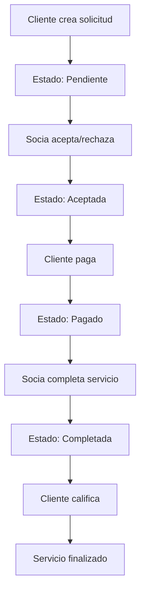

# LOOP - Gestión de Servicios Domésticos

## 📱 Descripción

LOOP es una aplicación móvil nativa para Android que digitaliza el ciclo completo de contratación y gestión de servicios domésticos, conectando clientes y socias trabajadoras mediante una plataforma confiable, escalable y fácil de usar.

## 🎯 Características Principales

### Para Clientes:
- ✅ Registro e inicio de sesión
- ✅ Exploración de catálogo de servicios
- ✅ Creación y gestión de solicitudes
- ✅ Pagos simulados
- ✅ Sistema de calificaciones y reseñas
- ✅ Seguimiento del estado de servicios

### Para Socias Trabajadoras:
- ✅ Panel de gestión de solicitudes
- ✅ Aceptar/rechazar solicitudes
- ✅ Marcar servicios como completados
- ✅ Gestión de perfil
- ✅ Visualización de solicitudes pendientes

## 🛠️ Tecnologías Utilizadas

- **Lenguaje**: Java
- **Plataforma**: Android (API 21+)
- **Base de Datos**: SQLite
- **Arquitectura**: MVC (Model-View-Controller)
- **Persistencia**: SharedPreferences para sesiones
- **UI/UX**: Material Design

## 📋 Requisitos del Sistema

- Android 5.0 (API level 21) o superior
- 50 MB de espacio libre
- Conexión a internet (opcional - funciona offline)

## 🚀 Instalación

1. Clona el repositorio:
```bash
git clone https://github.com/tu-usuario/LOOP-Gestion-Servicios-Domesticos.git
```

2. Abre el proyecto en Android Studio

3. Sincroniza las dependencias de Gradle

4. Ejecuta la aplicación en un dispositivo o emulador

## 👥 Cuentas de Prueba

### Cliente:
- **Email**: cliente@test.com
- **Contraseña**: 123456

### Socia:
- **Email**: socia@test.com
- **Contraseña**: 123456

## 📊 Estructura del Proyecto

```
app/
├── src/main/java/com/example/loopv7/
│   ├── activities/          # Actividades principales
│   ├── adapters/           # Adaptadores para RecyclerView
│   ├── database/           # Gestión de base de datos
│   ├── fragments/          # Fragmentos de la UI
│   ├── models/             # Modelos de datos
│   └── utils/              # Utilidades y helpers
├── src/main/res/
│   ├── layout/             # Archivos de diseño
│   ├── values/             # Recursos (colores, strings, etc.)
│   └── drawable/           # Iconos y recursos gráficos
└── build.gradle.kts        # Configuración de Gradle
```

## 🔄 Flujo de Estados



## 🎨 Capturas de Pantalla

*[Aquí puedes agregar capturas de pantalla de la aplicación]*

## 🤝 Contribuciones

Las contribuciones son bienvenidas. Por favor:

1. Fork el proyecto
2. Crea una rama para tu feature (`git checkout -b feature/AmazingFeature`)
3. Commit tus cambios (`git commit -m 'Add some AmazingFeature'`)
4. Push a la rama (`git push origin feature/AmazingFeature`)
5. Abre un Pull Request

## 📝 Licencia

Este proyecto está bajo la Licencia MIT. Ver el archivo `LICENSE` para más detalles.

## 👨‍💻 Autor

**Tu Nombre**
- GitHub: [@tu-usuario](https://github.com/tu-usuario)
- Email: tu-email@ejemplo.com

## 📞 Contacto

Si tienes preguntas o sugerencias, no dudes en contactarme.

---

⭐ ¡No olvides darle una estrella al proyecto si te gusta!
